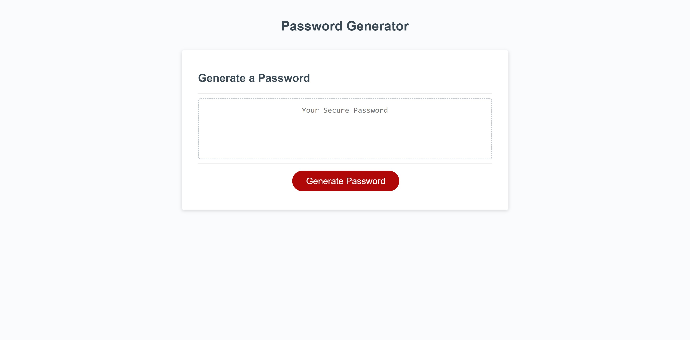

# Javascript Password Generator 

## Description
Create a password generator that secures access to sensitive data. Generate a password that meets these certain criteria. 

## Task
To generate a new password, the following requirements are met when:
- A prompt of the password length is displayed after clicking on the generate password button.
- Questions about whether to include an uppercase, lowercase, numeric, and/or special characters are confirmed.
- The password generator generates a new password after selecting all the prompts.
- The password is displayed in the page.

## Screenshot

## Link to the Final Page
[Link to the password generator web page]https://inna-arabejo.github.io/password-generator-js/

## Sources
- https://dev.to/code_mystery/random-password-generator-using-javascript-6a
- https://developer.mozilla.org/en-US/docs/Web/JavaScript/Reference/Global_Objects/Array/join